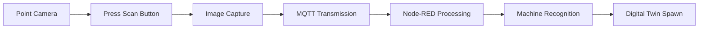

# Mixed Reality Industrial Digital Twin Project

Unity's **Mixed Reality Industrial Digital Twin** provides a complete framework for industrial machine recognition and digital twin visualization. This project extends Unity's MR template with advanced features including MQTT communication, machine recognition via computer vision, and dynamic digital twin spawning.

## 🆕 New Features Added

### 🏭 Digital Twin System
- **Real-time machine recognition** using camera scanning and AI processing
- **Dynamic digital twin spawning** based on recognized machine IDs  
- **MQTT communication** for real-time telemetry and command sending
- **Interactive 3D models** with status indicators and information panels

### 📡 MQTT Communication
- **Thread-safe MQTT client** with auto-reconnection capabilities
- **Real-time telemetry** data reception and command transmission
- **Integration with Node-RED** for image processing and machine recognition

### 🎯 Machine Scanning & Recognition
- **Camera-based scanning** with UI guidance
- **Computer vision processing** through MQTT image transmission
- **Automatic model revelation** when machines are recognized

---

## ⚙️ Core Components Configuration

### MQTT Communication Manager

The **MQTTCommunicationManager** handles all MQTT communications for telemetry and commands.

#### Configuration Settings:
| Setting | Value | Description |
|---------|--------|-------------|
| Broker Address | `192.168.1.100` | Your MQTT broker IP |
| Broker Port | `1883` | Default MQTT port |
| Client ID | `UnityMRApp` | Unique identifier |
| Connect On Start | ✅ | Auto-connect on startup |
| Debug Mode | ✅ | Enable for development |


*MQTT Manager inspector showing broker settings*

#### Key MQTT Topics:
- `machine/scan/image` - Send captured images for recognition
- `machine/scan/result` - Receive machine IDs from Node-RED  
- `machine/telemetry/{machineId}` - Receive real-time machine data
- `machine/command/{machineId}` - Send commands to machines

### Digital Twin Manager

The **DigitalTwinManager** manages spawning and lifecycle of digital twins.

#### Configuration Settings:
| Field | Example Value | Description |
|-------|---------------|-------------|
| Machine Mappings | See table below | List of machine ID to prefab mappings |
| Default Digital Twin | `GenericMachineDigitalTwin` | Fallback prefab |
| Spawn Distance | `1.0f` | Distance from camera to spawn |
| Spawn Offset | `(0, 0, 0)` | Position offset for spawning |

#### Machine Mappings Example:
| Machine ID | Digital Twin Prefab | Description |
|------------|-------------------|-------------|
| `motor_001` | `MotorDigitalTwin` | Electric Motor - 3 Phase |
| `pump_002` | `PumpDigitalTwin` | Industrial Water Pump |
| `conveyor_003` | `ConveyorDigitalTwin` | Belt Conveyor System |


*Digital Twin Manager inspector showing machine mappings configuration*

### Digital Twin Component

Each **DigitalTwin** prefab includes interactive features and real-time data visualization.

#### Configuration Settings:
| Field | Example Value | Description |
|-------|---------------|-------------|
| Machine ID | `motor_001` | Auto-assigned during spawn |
| Reveal Animation Duration | `1.0f` | Animation time in seconds |
| Status Materials | See below | Materials for different states |
| Selection Highlight | `HighlightGameObject` | Visual feedback object |
| Info Panel | `InformationPanel` | UI prefab for data display |

#### Status Materials:
- 🟢 **Normal**: Green material for operational state
- 🟡 **Warning**: Yellow material for alert state  
- 🔴 **Error**: Red material for fault state

#### MQTT Configuration:
- **Telemetry Topic Prefix**: `machine/telemetry/`
- **Command Topic Prefix**: `machine/command/`


*Digital Twin inspector showing materials and prefab assignments*

---

## 🔍 Machine Scanning System

### Machine Scanner

The **MachineScanner** component handles camera capture and recognition processing.

#### Setup Checklist:
- [ ] Assign XR Camera reference
- [ ] Configure MQTT topic names  
- [ ] Link to Digital Twin Manager
- [ ] Connect UI Controller

#### Required References:
| Component | Purpose |
|-----------|---------|
| `XR Camera` | Image capture source |
| `MQTT Manager` | Communication handler |
| `Digital Twin Manager` | Twin spawning |
| `Scan UI Controller` | User interface |


*Machine Scanner inspector showing component references*

### Scan UI Controller

The **ScanUIController** manages user interface during scanning process.

#### UI Elements:
- 📋 **Scan instructions panel** - User guidance
- ⏳ **Scanning indicator** - Progress feedback  
- 📊 **Result display panel** - Success/failure messages
- 🔗 **Connection status indicator** - MQTT status

### Scan Button Handler

Attach **ScanButtonHandler** to any XR interactable button to trigger scanning.

```csharp
// Example usage in inspector:
// 1. Add XRGrabInteractable to button GameObject
// 2. Add ScanButtonHandler component  
// 3. Assign MachineScanner reference
```

---

## 📚 Usage Instructions

### 1. Setting Up MQTT Communication

```csharp
// The MQTT manager auto-connects on start
// Monitor connection status in console
// Subscribe to topics programmatically:
mqttManager.Subscribe("your/topic", OnMessageReceived);

// Publishing messages
mqttManager.Publish("machine/command/motor_001", "{\"action\":\"start\"}");
```

### 2. Adding New Machine Types

1. **Create Digital Twin Prefab**
   - Design 3D model with materials
   - Add `DigitalTwin` component
   - Configure status materials

2. **Register in Digital Twin Manager**
   - Add new entry to Machine Mappings
   - Set unique Machine ID
   - Assign prefab reference

3. **Test Recognition**
   - Scan machine with camera
   - Verify MQTT communication
   - Check twin spawning behavior

### 3. Scanning Workflow



#### Step-by-Step Process:
1. 📷 **Point camera** at the target machine
2. 🔘 **Press scan button** (XR interactable)
3. ⏱️ **Wait for processing** (image sent via MQTT)
4. 🎯 **View result** (digital twin spawns automatically)

### 4. Interacting with Digital Twins

| Action | Method | Result |
|--------|--------|--------|
| **Grab** | XR Controller/Hand | Inspect and rotate model |
| **Select** | Point and trigger | Show information panel |
| **Command** | MQTT integration | Send control signals |
| **Monitor** | Color indicators | Real-time status feedback |

---

## 🔄 Node-RED Integration

### Required Flow Architecture

```json
{
  "flow": [
    "MQTT Input (machine/scan/image)",
    "Base64 Decoder", 
    "Computer Vision Processing",
    "Machine Classification",
    "MQTT Output (machine/scan/result)"
  ]
}
```

### Required Node-RED Nodes:
- **MQTT Input/Output** - Communication with Unity
- **Base64 Decoder** - Image processing  
- **Computer Vision** - Machine learning inference
- **Classification Logic** - Machine type identification

### Example Node-RED Flow:
```javascript
// Simplified flow structure
[MQTT In] → [Base64] → [CV Model] → [Classification] → [MQTT Out]
```

---

## 📁 Project Structure

```
Assets/
├── 📂 Scripts/
│   ├── 🔧 DigitalTwin.cs
│   ├── 🏭 DigitalTwinManager.cs  
│   ├── 📡 MQTTCommunicationManager.cs
│   ├── 📷 MachineScanner.cs
│   ├── 🖥️ ScanUIController.cs
│   ├── 🔘 ScanButtonHandler.cs
│   ├── 👁️ HideUntilRecognized.cs
│   └── 📌 SnapBackToOrigin.cs
├── 📂 Prefabs/
│   ├── 🏭 DigitalTwins/
│   │   ├── MotorDigitalTwin.prefab
│   │   ├── PumpDigitalTwin.prefab
│   │   └── ConveyorDigitalTwin.prefab
│   ├── 🖥️ UI/
│   │   ├── ScanPanel.prefab
│   │   └── InfoPanel.prefab
│   └── 📷 Scanning/
│       └── ScanButton.prefab
├── 📂 Materials/
│   └── 🎨 StatusIndicators/
│       ├── NormalStatus.mat
│       ├── WarningStatus.mat
│       └── ErrorStatus.mat
└── 📂 Documentation/
    └── 🖼️ images/
```

---

## 🔧 Troubleshooting

### MQTT Connection Issues
| Problem | Solution |
|---------|----------|
| ❌ Connection Failed | Check broker address and port |
| 🌐 Network Error | Verify network connectivity |
| 🔍 Debug Info | Monitor debug logs in console |
| 🔄 Auto-Reconnect | Enable in MQTT Manager settings |

### Scanning Problems  
| Problem | Solution |
|---------|----------|
| 📷 Poor Image Quality | Ensure good lighting conditions |
| 🔒 Camera Access | Check camera permissions |
| 🔄 No Response | Verify Node-RED flow is running |
| ⚡ Slow Processing | Optimize image resolution |

### Digital Twin Not Spawning
| Problem | Solution |
|---------|----------|
| 🗺️ Missing Mapping | Check machine mapping configuration |
| 🎯 No Prefab | Verify prefab assignments |
| 📡 MQTT Issue | Monitor MQTT message reception |
| 🆔 Wrong ID | Validate machine ID format |

---

## 🎮 Original MR Template Features

*The project retains all original Unity MR template functionality:*

### MR Interaction Setup
The **MR Interaction Setup** in Unity is the main GameObject for configuring the extended reality (XR) camera and the origin point of the XR experience in Unity. The MR Interaction Setup includes additional configuration beyond the basic XR Origin Setup, such as:

- 🎮 Different input systems such as Controllers and Hands
- 👆 Various interactors (poke, direct, ray) driven by that input
- 🏭 **Enhanced with industrial scanning capabilities**

### Context-Aware Features
The MR Example includes various essential features for mixed reality development, including demonstrating basic plane detection and passthrough.

For plane detection, the **AR Session** controls the lifecycle and configuration options for an AR session and is located in the **MR Interaction Setup** GameObject. There is only one active session. If you have multiple ARSession components, they all communicate to the same session and will conflict with each other. The **AR Plane Manager** creates GameObjects for each detected plane in the environment. The component is located on the same GameObject as the XR Origin component.


*Original AR Plane Manager configuration*

### Spatial UI
The Sample Scene contains various spatial UI examples which allows both near and far interactions with UI elements, **now enhanced with industrial scanning and digital twin interfaces**.

#### New Industrial UI Components:
- 📱 **Scan Interface** - Camera-based machine recognition
- 📊 **Twin Information Panels** - Real-time machine data
- 🔘 **Control Buttons** - MQTT command interfaces
- 📡 **Connection Status** - Network connectivity indicators

---

## 🖥️ Platform Support

Unity directly supports the following Mixed Reality platforms:

| Platform | Link | Support Level |
|----------|------|---------------|
| **OpenXR** | [Documentation](https://docs.unity3d.com/Packages/com.unity.xr.openxr@latest/index.html) | ✅ Full Support |
| **Meta Quest** | [Developer Docs](https://developer.oculus.com/documentation/unity/unity-gs-overview/) | ✅ Full Support |
| **HoloLens 2** | [Microsoft Docs](https://learn.microsoft.com/en-us/windows/mixed-reality/develop/unity/unity-development-wmr-overview) | ✅ Full Support |
| **Magic Leap 2** | [ML Developer Docs](https://developer-docs.magicleap.cloud/docs/guides/unity/getting-started/unity-getting-started/index.html) | ✅ Full Support |

---

## 📦 Dependencies

### Unity Packages
```json
{
  "dependencies": {
    "com.unity.xr.arfoundation": "5.0.6",
    "com.unity.xr.interaction.toolkit": "2.5.2", 
    "com.unity.textmeshpro": "3.0.6",
    "com.unity.inputsystem": "1.7.0"
  }
}
```

### External Libraries
- **M2MQTT for Unity** - MQTT client implementation
- **Newtonsoft.Json** - JSON serialization/deserialization

### External Systems
| System | Purpose | Requirements |
|--------|---------|--------------|
| **MQTT Broker** | Message communication | Mosquitto, HiveMQ, or similar |
| **Node-RED** | Image processing pipeline | Computer vision nodes |
| **ML Model** | Machine recognition | TensorFlow/PyTorch model |

---

## 🚀 Getting Started

### Quick Setup Guide

1. **Clone the repository**
   ```bash
   git clone https://github.com/your-repo/mixed-reality-digital-twin.git
   ```

2. **Open in Unity 2022.3 LTS or newer**

3. **Configure MQTT Settings**
   - Set broker address in `MQTTCommunicationManager`
   - Test connection in play mode

4. **Setup Node-RED Flow**
   - Import computer vision nodes
   - Configure MQTT broker connection
   - Test image processing pipeline

5. **Build and Deploy**
   - Select target platform (Android for Quest)
   - Build and run on device
   - Test scanning functionality

### Performance Recommendations

| Setting | Quest 2 | Quest Pro/3 | HoloLens 2 |
|---------|---------|--------------|------------|
| **Texture Quality** | Medium | High | Medium |
| **Shadow Quality** | Low | Medium | Low |
| **Anti-Aliasing** | None | 2x MSAA | None |
| **Target FPS** | 72 Hz | 90 Hz | 60 Hz |

---

## 🎓 Academic Project Information

This project demonstrates the integration of:

- **🏭 Industrial IoT** - Real-time machine monitoring
- **👁️ Computer Vision** - Automated object recognition  
- **🥽 Mixed Reality** - Immersive 3D visualization
- **📡 Edge Computing** - Distributed processing architecture

### Key Technologies Used:
- Unity 3D Engine
- XR Interaction Toolkit
- MQTT Protocol
- Node-RED Flow Programming
- Machine Learning Models
- Mixed Reality SDKs

---

## 📄 License

This project is developed for academic purposes and extends Unity's Mixed Reality template with industrial applications.

---

## 🤝 Contributing

For academic collaboration or questions about implementation:

1. Fork the repository
2. Create feature branch
3. Submit pull request with detailed description

---

*This project demonstrates next-generation manufacturing applications through the integration of industrial IoT, computer vision, and mixed reality technologies.*